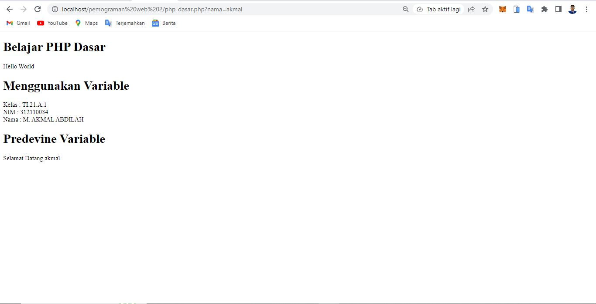
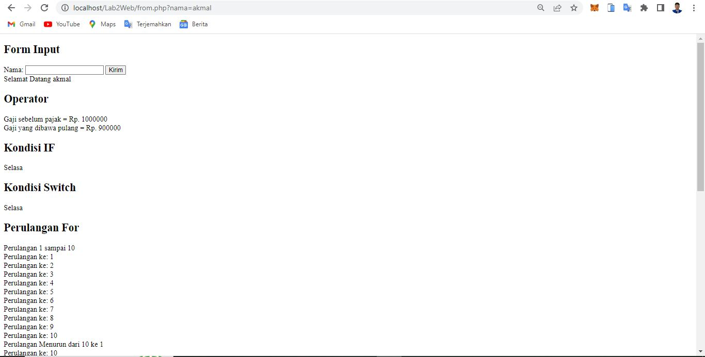
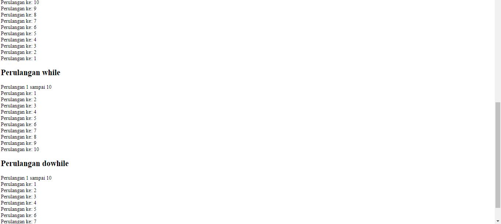
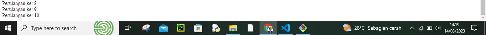

# Lab2Web

<h3>Biodata Mahasiswa</h3>           
    <table>
        
<tr>
               <td>Kelas</td>
               <td>:</td>
               <td>TI.21.A.1</td>
               <td>&nbsp;</td>
       </tr>

       
<tr>
               <td>Nama</td>
               <td>:</td>
               <td>M. AKMAL AL ABDILAH</td>
               <td>&nbsp;</td>
       </tr>

       
<tr>
               <td>Nim</td>
               <td>:</td>
               <td>312110034</td>
               <td>&nbsp;</td>
       </tr>

       </table>

Assalam'mulaikum wr wb. 
 

Di tugas pratikum kali ini saya akan membagikan sedikit shering mengenai program php dasar, tampa berlama lama lagi saya kan mesering foto hasil output programnya.

# Tugas_Pratikum_2

1. Tampilan program di dekstop(komputer)

Di atas adalah output program yang ada di bawah.

