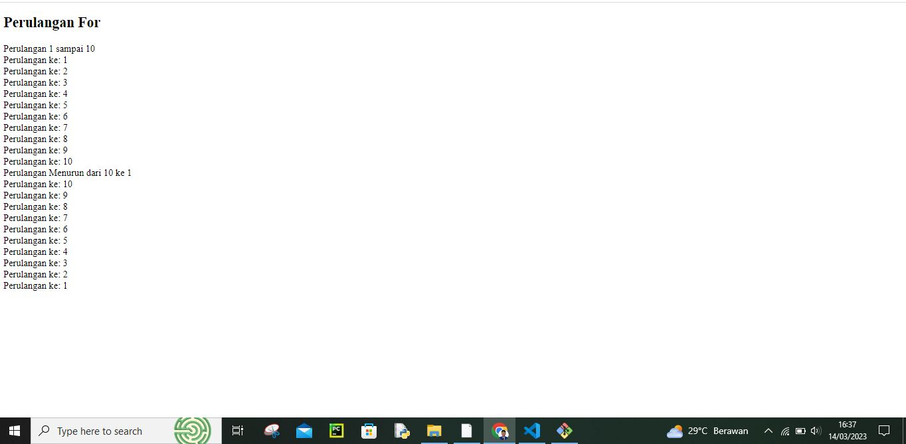
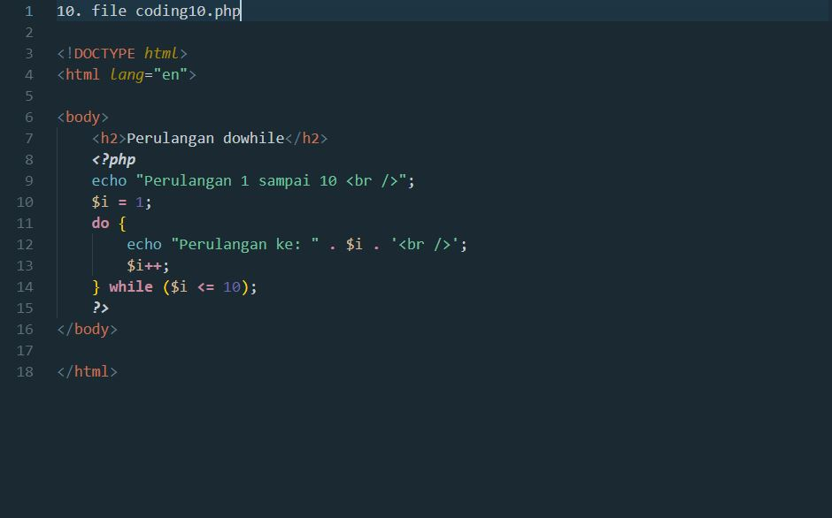

# Lab2Web

<h3>Biodata Mahasiswa</h3>           
    <table>
        
<tr>
               <td>Kelas</td>
               <td>:</td>
               <td>TI.21.A.1</td>
               <td>&nbsp;</td>
       </tr>

       
<tr>
               <td>Nama</td>
               <td>:</td>
               <td>M. AKMAL AL ABDILAH</td>
               <td>&nbsp;</td>
       </tr>

       
<tr>
               <td>Nim</td>
               <td>:</td>
               <td>312110034</td>
               <td>&nbsp;</td>
       </tr>

       </table>

Assalam'mulaikum wr wb. 
 

Di tugas pratikum kali ini saya akan membagikan sedikit shering mengenai program php dasar, tanpa berlama lama lagi saya kan mesering foto hasil output dari 10 coding di bawah apa bila di satukan menjadi satu file program.

# Tugas_Pratikum_2

Tampilan program di dekstop(komputer)

Jika kalian penasaran dan ingin mencoba program di file coding kalian harus menginstall xampp dan visual code.

PHP dasar

Jika sudang menginsatall xampp dan visual code kalian bisa mencoba 10 coding php di bawah ini coding dibawah ini versi file coding terpisah jika ingin versi yang satu file kalian bisa coba file php_dasar.php  di dalam file ini terdapat tiga coding yang di jadikan satu coding1.php sampai coding3.php, ada juga satu file lagi yang menggambukan tujuh coding nama filenya from.php di dalam file ini terdapan 7 coding yang di jadikan satu dari coding4.php sampai coding10.php.

Kemudian untung memanggil koding di atas kalian bisa menulis url seperti ini Kemudian untuk mengakses hasilnya melalui URL: http://localhost/Lab2Web/coding/coding1.php
sebelum mengakses coding pastikan file sudah di pindahkan ke xampp/htdocs dan pastikan xamppnya di star, dan jika berhasil nanti hasil outputnya seperti di bawah ini

Bedanya dari coding sebelumnya adalah isi coding di dalam body di ubah dan di perbannyak sedikit dan menghasilkan output seperti di bawah.

Bedanya dari coding sebelumnya adalah di bagian coding head di hapus juga cara memanggilnya coding ini berbeda bisanya pakai url http://localhost/Lab2Web/coding/coding3.php di pencaian, crom dan sekarang url untukmemunculkan hasil code koding3.php harung menggunakan url ini supaya muncul dan tidak eror http://localhost/Lab2Web/coding/coding1.php?nama=akmal maka akan muncul outpu seperti di bawah ini.

Karena coding yang selanjutnya sama memunculkannya dengan penjelasan di atas saya akan memunculkan coding dan outupnya saja tanpa penjelasan karna sudah say jelaskan di atas selamat mencoba codingnya.

Hasil Outpunya.

Hasil Outpunya.

Hasil Outpunya.

Hasil Outpunya.

Hasil Outpunya.

Hasil Outpunya.

Hasil Outpunya.

